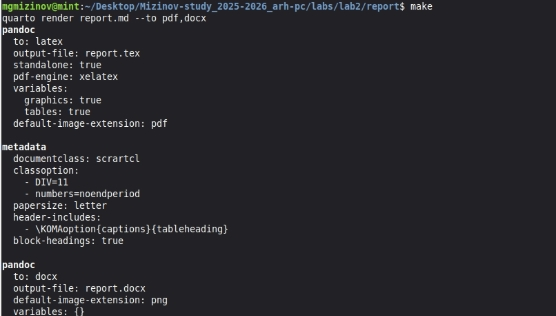
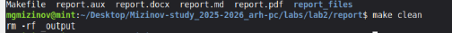
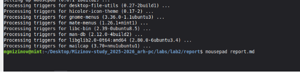
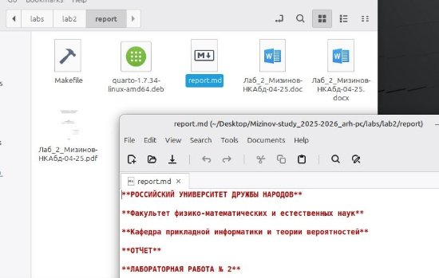

**РОССИЙСКИЙ УНИВЕРСИТЕТ ДРУЖБЫ НАРОДОВ** 

**Факультет физико-математических и естественных наук Кафедра прикладной информатики и теории вероятностей** 

**ОТЧЕТ** 

` `**ЛАБОРАТОРНАЯ РАБОТА № 3**  *дисциплина:  Архитектура компьютера *

Студент:  Мизинов М.Г.                      

Группа: НКАбд-04-25 

№ ст. билета: 1032253540                       

**МОСКВА** 2025 г. 

СОДЕРЖАНИЕ 

[Список иллюстраций......................................................................................................... 3 ](#_page2_x82.00_y56.92)[Список таблиц .................................................................................................................... 4 ](#_page3_x82.00_y56.92)[Основная часть................................................................................................................... 5 ](#_page4_x82.00_y56.92)

1. [Цель работы ............................................................................................................. 5 ](#_page4_x82.00_y101.92)
2. [Задание ..................................................................................................................... 5 ](#_page4_x82.00_y187.92)
2. [Теоретическое введение ......................................................................................... 5 ](#_page4_x82.00_y284.92)
2. [Выполнение лабораторной работы........................................................................ 5 ](#_page4_x82.00_y438.92)
2. [Задание для самостоятельной работы ................................................................... 6 ](#_page5_x82.00_y465.92)

[Выводы ............................................................................................................................... 8 ](#_page7_x82.00_y56.92)[Список литературы ............................................................................................................ 9 ](#_page8_x82.00_y56.92)

Список иллюстраций 

Рисунок 1 – Компиляция шаблона.…………………………………………………….5 Рисунок 2 – Проверка……….………….……………………………………………….6 Рисунок 3 – Удаление сгенерированных шаблонов …………………...……………..6 Рисунок 4 – Подготовка отчёта ………………...……………………………………...7 Рисунок 5 – Отчет по 2 лабораторной работе ……………………………………...…8 

Список таблиц

Основная часть 

Github: https://github.com/MihailMizinov/Mizinov-study\_2025-2026\_arh-pc 

1. Цель работы 

Целью работы является освоение навыка оформления отчетов с помощью языка разметки Markdown. 

2. Задание 

Установка необходимого ПО 

Задание для самостоятельной работы 

3. Теоретическое введение 

Markdown — [облегчённый язык разметки, ](https://ru.wikipedia.org/wiki/%D0%AF%D0%B7%D1%8B%D0%BA_%D1%80%D0%B0%D0%B7%D0%BC%D0%B5%D1%82%D0%BA%D0%B8#%D0%9E%D0%B1%D0%BB%D0%B5%D0%B3%D1%87%D1%91%D0%BD%D0%BD%D1%8B%D0%B5_%D1%8F%D0%B7%D1%8B%D0%BA%D0%B8_%D1%80%D0%B0%D0%B7%D0%BC%D0%B5%D1%82%D0%BA%D0%B8)созданный с целью обозначения форматирования в[ простом тексте, ](https://ru.wikipedia.org/wiki/%D0%A2%D0%B5%D0%BA%D1%81%D1%82%D0%BE%D0%B2%D1%8B%D0%B5_%D0%B4%D0%B0%D0%BD%D0%BD%D1%8B%D0%B5)с максимальным сохранением его читаемости человеком, и пригодный для машинного преобразования в языки для продвинутых публикаций. 

4. Выполнение лабораторной работы 

Провожу компиляцию шаблона с помощью команды make (рис. 1) 

Рис. 1: Компиляция шаблона 

Проверяю корректность исполнения команды с помощью команды ls (рис. 2) 

Рис. 2: Проверка 

После  проверки  работоспособности  компилятора  шаблонов,  я  удаляю сгенерированные файлы с помощью команды make clean (рис. 3) 

Рис. 3: Удаление сгенерированных шаблонов 

С помощью редактора выполняю отчет по выполненной лабораторной работе  (рис. 4) 

Рис. 4: Подготовка отчёта 

5. Задание для самостоятельной работы 

В соответствующем каталоге сделайте отчёт по лабораторной работе № 2 в формате  Markdown.  В  качестве  отчёта  необходимо  предоставить  отчёты  в  трех форматах: pdf, docx и md (рис. 5). 

Рис. 5: Отчет по 2 лабораторной работе 

Выводы 

В результате выполнения данной лабораторной работы я освоил процедуры 

оформления отчетов с помощью языка разметки Markdown. 

Список литературы 

1) Лабораторная  работа  №3. 

https://esystem.rudn.ru/pluginfile.php/2945867/mod\_resource/content/0/lab3.pdf 

2) Википедия. https://en.wikipedia.org/wiki/GitHub 
9 
