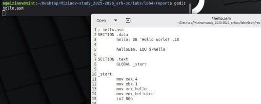
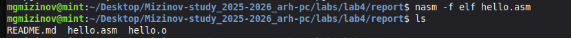
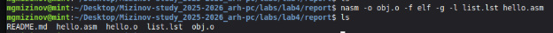
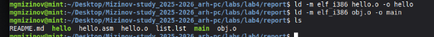
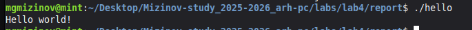
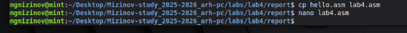
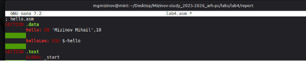
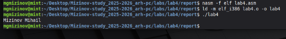
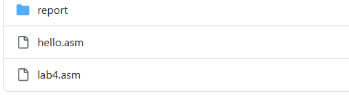

**РОССИЙСКИЙ УНИВЕРСИТЕТ ДРУЖБЫ НАРОДОВ** 

**Факультет физико-математических и естественных наук Кафедра прикладной информатики и теории вероятностей** 

**ОТЧЕТ** 

` `**ЛАБОРАТОРНАЯ РАБОТА № 4**  *дисциплина:  Архитектура компьютера *

Студент:  Мизинов М.Г.                      

Группа: НКАбд-04-25 

№ ст. билета: 1032253540                       

**МОСКВА** 2025 г. 

СОДЕРЖАНИЕ 

[Список иллюстраций......................................................................................................... 3 ](#_page2_x82.00_y56.92)[Список таблиц .................................................................................................................... 4 ](#_page3_x82.00_y56.92)[Основная часть................................................................................................................... 5 ](#_page4_x279.00_y56.92)

1. [Цель работы ............................................................................................................. 5 ](#_page4_x82.00_y119.92)
2. [Теоретическое введение ......................................................................................... 5 ](#_page4_x82.00_y205.92)
2. [Задание ..................................................................................................................... 5 ](#_page4_x82.00_y404.92)
2. [Выполнение лабораторной работы........................................................................ 5 ](#_page4_x82.00_y513.92)
1. [Программа Hello world! ........................................................................................ 5 ](#_page4_x82.00_y565.92)

   2. [Транслятор NASM ............................................................................................... 6 ](#_page5_x82.00_y246.92)
   2. [Расширенный синтаксис командной строки NASM ........................................ 6 ](#_page5_x82.00_y413.92)
   2. [Компоновщик LD................................................................................................. 6 ](#_page5_x82.00_y562.92)
   2. [Запуск исполняемого файла ............................................................................... 7 ](#_page6_x82.00_y56.92)
5. [Задание для самостоятельной работы ................................................................... 7 ](#_page6_x82.00_y184.92)

[Выводы ............................................................................................................................... 8 ](#_page7_x82.00_y56.92)[Список литературы ............................................................................................................ 9 ](#_page8_x82.00_y56.92)

Список иллюстраций 

Рисунок 1 – hello.asm …….………………………………………………………....….5 Рисунок 2 – появление hello.o ………………………………………………………....6 Рисунок 3 –два новых файла.………….……………………………………………….6 Рисунок 4 – исполняемые файлы ……………………………………………….……..6 Рисунок 5 – запуск ……………………………………………………………………...7 Рисунок 6 – копия ………………………………………………………………………7 Рисунок 7 – изменение файла ………………………………………………….………7 Рисунок 8 –вывод фи…………………………………………………………..………..7 Рисунок 9 – загруженный файлы ………………………………………….…………..7 

Список таблиц 

`    `Основная часть 

Ссылка на github: https://github.com/MihailMizinov/Mizinov-study\_2025-

2026\_arh-pc/tree/master/labs 

1. Цель работы 

Освоение процедуры компиляции и сборки программ, написанных на ассемблере NASM. 

2. Теоретическое введение 

Основными функциональными элементами любой электронно-вычислительной 

машины (ЭВМ) являются центральный процессор, память и периферийные устройства (рис. 4.1). Взаимодействие этих устройств осуществляется через общую шину, к которой они подключены. Физически шина представляет собой большое количество проводников, соединяющих устройства друг с другом. В современных компьютерах проводники выполнены в виде электропроводящих дорожек на материнской (системной) плате. 

3. Задание 

Рассмотрим  пример  простой  программы  на  языке  ассемблера  NASM. Традиционно первая программа выводит приветственное сообщение Hello world! на экран. 

4. Выполнение лабораторной работы 

**4.1 Программа Hello world!** 

Создал файл hello.asm и заполнил кодом. 

Рисунок 1 – hello.asm 

2. **Транслятор NASM** 

Компилировал  приведённый  выше  текст  программы  «Hello  World»  и проверил, что объектный файл был создан (рис. 2):

Рисунок 2 – появление hello.o 

3. **Расширенный синтаксис командной строки NASM** 

Скомпилировал исходный файл hello.asm в obj.o с форматом elf и проверил, что файлы были созданы (рис. 3): 

Рисунок 3 – два новых файла 

4. **Компоновщик LD** 

Передала  программу  на  обработку  компоновщику  и  проверила,  что исполняемый файл hello был создан (рис. 4): 

Рисунок 4 – исполняемые файлы 

5. **Запуск исполняемого файла** 

Запуск исполняемого файла (рис. 5): 

Рисунок 5 – запуск 

5. Задание для самостоятельной работы 

Создал копию файла hello.asm с именем lab4.asm (рис. 6): 

Рисунок 6 – копия Вывод имени в коде вместо hello world (рис. 7): 

Рисунок 7 – изменение файла Вывод имени в коде вместо hello world (рис. 8): 

Рисунок 8 – вывод фи 

Загрузил файлы в гитхаб (рис. 9): 

Рисунок 9 – загруженный файлы 

Выводы 

Навыки компиляции и сборки программ, написанных на ассемблере NASM были успешно освоены. 

Список литературы 

1) Лабораторная  работа  №4. 

https://esystem.rudn.ru/pluginfile.php/2089084/mod\_resource/content/0/%D0%9B%D0 %B0%D0%B1%D0%BE%D1%80%D0%B0%D1%82%D0%BE%D1%80%D0%BD%D 0%B0%D1%8F%20%D1%80%D0%B0%D0%B1%D0%BE%D1%82%D0%B0%20%E 2%84%964.%20%D0%A1%D0%BE%D0%B7%D0%B4%D0%B0%D0%BD%D0%B8 %D0%B5%20%D0%B8%20%D0%BF%D1%80%D0%BE%D1%86%D0%B5%D1%81 %D1%81%20%D0%BE%D0%B1%D1%80%D0%B0%D0%B1%D0%BE%D1%82%D 0%BA%D0%B8%20%D0%BF%D1%80%D0%BE%D0%B3%D1%80%D0%B0%D0% BC%D0%BC%20%D0%BD%D0%B0%20%D1%8F%D0%B7%D1%8B%D0%BA%D0 %B5%20%D0%B0%D1%81%D1%81%D0%B5%D0%BC%D0%B1%D0%BB%D0%B 5%D1%80%D0%B0%20NASM.pdf 

2) Википедия. https://en.wikipedia.org/wiki/GitHub 
9 
