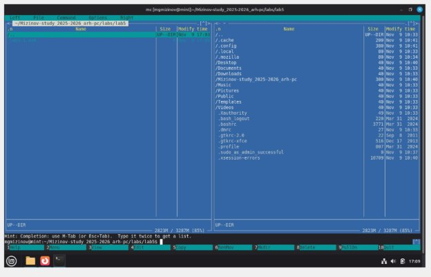
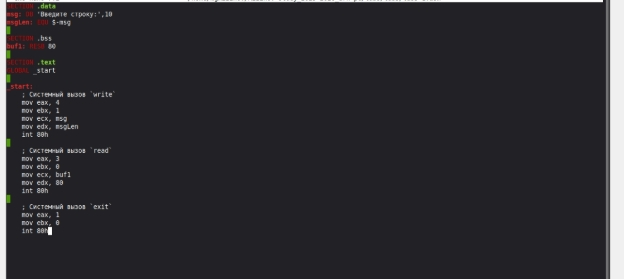
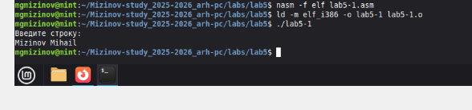
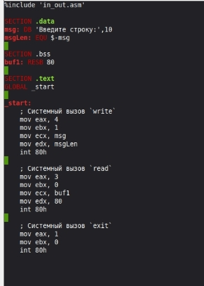
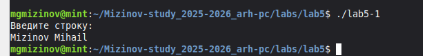
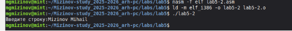
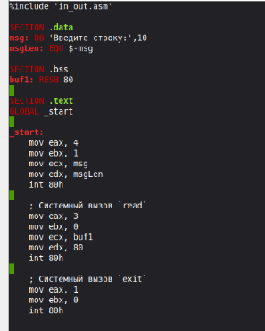
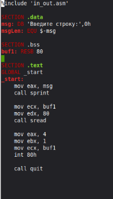

**РОССИЙСКИЙ УНИВЕРСИТЕТ ДРУЖБЫ НАРОДОВ** 

**Факультет физико-математических и естественных наук Кафедра прикладной информатики и теории вероятностей** 

**ОТЧЕТ** 

` `**ЛАБОРАТОРНАЯ РАБОТА № 5**  *дисциплина:  Архитектура компьютера *

Студент:  Мизинов М.Г.                      

Группа: НКАбд-04-25 

№ ст. билета: 1032253540                       

**МОСКВА** 2025 г. 

СОДЕРЖАНИЕ 

[Список иллюстраций......................................................................................................... 3 ](#_page2_x82.00_y56.92)[Список таблиц .................................................................................................................... 4 ](#_page3_x82.00_y56.92)[Основная часть................................................................................................................... 5 ](#_page4_x82.00_y56.92)

1. [Цель работы ............................................................................................................. 5 ](#_page4_x82.00_y83.92)
2. [Теоретическое введение ......................................................................................... 5 ](#_page4_x82.00_y167.92)
2. [Задание ..................................................................................................................... 5 ](#_page4_x82.00_y331.92)
2. [Выполнение лабораторной работы........................................................................ 6 ](#_page5_x82.00_y56.92)
1. [Основы работы c Midnight Commander .............................................................. 6 ](#_page5_x82.00_y109.92)
1. [Работа в NASM ................................................................................................. 8 ](#_page7_x82.00_y56.92)
1. [Подключение внешнего файла ........................................................................ 8 ](#_page7_x82.00_y521.92)
5. [Задание для самостоятельной работы ................................................................. 11 ](#_page10_x230.00_y189.92)

[Выводы ............................................................................................................................. 13 ](#_page12_x82.00_y56.92)[Список литературы .......................................................................................................... 14 ](#_page13_x82.00_y56.92)

Список иллюстраций 

Рисунок 1 – Открытие Midnight Commander …….…………………………...…...….6 Рисунок 2 – Открытый каталог ….…………………………………………………….6 Рисунок 3 – Создание рабочего подкаталога ………….…………………..………….7 Рисунок 4 – Создание файла в Midnight Commander …………………….…………..7 Рисунок 5 – Редактирование файла в Midnight Commander …………………………8 Рисунок 6 – Трансляция, компоновка и последующий запуск программы…………8 Рисунок 7 – Перенос in\_out в рабочий каталог ………………….….………………..10 Рисунок 8 – Создание копии файла в Midnight Commander…………….……….…..10 Рисунок 9 – Изменение программы …………………………..………………………10 

Список таблиц 

Основная часть 

1. Цель работы 

Приобретение  практических  навыков  работы  в  Midnight  Commander. Освоениеинструкций языка ассемблера mov и int. 

2. Теоретическое введение 

GNU  Midnight  Commander  -  это  визуальный  файловый  менеджер, 

распространяемый под лицензией  GPL, и поэтому он квалифицируется как  Free Software.  Это  мощная  текстовая  полнофункциональная  программа,  которая позволяет  вам  копировать,  перемещать  и  удалять  файлы  и  директории, производить поиск файлов и запускать на выполнение команды оболочки. Также включены встроенные редактор и программа для просмотра файлов. 

3. Задание 

На  основе  методических  указаний  провести  ознакомительную  работу  с Midnight Commander. 

4. Выполнение лабораторной работы 
1. **Основы работы c Midnight Commander** 

Открытие Midnight Commander (рис. 1). 

Рис. 1: Открытие Midnight Commander 

Перехожу в созданный каталог в предыдущей лабораторной работе (рис. 2). 

Рис. 2: Открытый каталог 

С помощью функциональной клавиши, я создаю подкаталог lab5, в котором буду работать (рис. 3). 

Рис. 3: Создание рабочего подкаталога В строке ввода вводим команду touch и создаю файл (рис. 4). 

Рис. 4: Создание файла в Midnight Commander 

2. **Работа в NASM** 

С помощью F4 открываю только что созданный файл и вношу код с листинга (рис. 5). Проверяю сохраненные изменения с помощью клавиши F3. 

Рис. 5: Редактирование файла в Midnight Commander Транслирую и компоную измененный файл, запускаю (рис. 6). 

Рис. 6: Трансляция, компоновка и последующий запуск программы 

3. **Подключение внешнего файла** 

Скачанный с ТУИС файл сохраняю в общую папку на своем компьютере, на виртуальной машине в интерфейсе Midnight Commander перехожу в директорию общей папки, копирую файл в рабочий подкаталог. (рис. 7). 

Рис. 7: Перенос in\_out в рабочий каталог Создаю копию файла для последующей работы с ним (рис. 8). 

Рис. 8: Создание копии файла в Midnight Commander 

В копии файла подключаю подпрограмму из подключенного файла (рис. 9). 

Рис. 9: Изменение программы 

Транслирую, компоную и запускаю программу с подключенным файлом (рис. 10). 

Рис. 10: Запуск измененной программы 

Редактирую файл и заменяю в нем подпрограмму sprintLF на sprint. Разница подпрограмм в том, что вторая вызывает ввод на той же строке (рис. 11). 

Рис. 11: Изменение программы 2й 

Рис. 12: Запуск измененной программы 2й 

5. Задание для самостоятельной работы 

Создаю копию lab5-1.asm, редактирую так, чтобы в конце выводилась введеная мною строка с клавиатуры (рис. 13). 

Рис. 13: Редактирование копии 3й Транслирую, компоную и запускаю свою программу (рис. 14). 

Рис. 14: Запуск своей программы 

Создаю копию lab5-2.asm, редактирую так, чтобы в конце выводилась введеная мною строка с клавиатуры (рис. 15). 

Рис. 15: Редактирование копии 4й Транслирую, компоную и запускаю свою программу (рис. 16). 

Рис. 16: Запуск своей программы 

Ссылка на github: https://github.com/MihailMizinov/Mizinov-study\_2025-

2026\_arh-pc 

Выводы 

При  выполнении  данной  лабораторной  работы  я  приобрёл практические навыки работы в Midnight Commander на базовом уровне. 

Список литературы 

1) Лабораторная  работа  №5. 

https://esystem.rudn.ru/pluginfile.php/2089085/mod\_resource/content/0/%D0%9B%D0 %B0%D0%B1%D0%BE%D1%80%D0%B0%D1%82%D0%BE%D1%80%D0%BD%D 0%B0%D1%8F%20%D1%80%D0%B0%D0%B1%D0%BE%D1%82%D0%B0%20%E 2%84%965.%20%D0%9E%D1%81%D0%BD%D0%BE%D0%B2%D1%8B%20%D1% 80%D0%B0%D0%B1%D0%BE%D1%82%D1%8B%20%D1%81%20Midnight%20Co mmander%20%28%29.%20%D0%A1%D1%82%D1%80%D1%83%D0%BA%D1%82 %D1%83%D1%80%D0%B0%20%D0%BF%D1%80%D0%BE%D0%B3%D1%80%D0 %B0%D0%BC%D0%BC%D1%8B%20%D0%BD%D0%B0%20%D1%8F%D0%B7% D1%8B%D0%BA%D0%B5%20%D0%B0%D1%81%D1%81%D0%B5%D0%BC%D0 %B1%D0%BB%D0%B5%D1%80%D0%B0%20NASM.%20%D0%A1%D0%B8%D1 %81%D1%82%D0%B5%D0%BC%D0%BD%D1%8B%D0%B5%20%D0%B2%D1%8 B%D0%B7%D0%BE%D0%B2%D1%8B%20%D0%B2%20%D0%9E%D0%A1%20G NU%20Linux.pdf 

2) Википедия. https://en.wikipedia.org/wiki/GitHub 
14 
