**РОССИЙСКИЙ УНИВЕРСИТЕТ ДРУЖБЫ НАРОДОВ** 

**Факультет физико-математических и естественных наук Кафедра прикладной информатики и теории вероятностей** 

**ОТЧЕТ** 

` `**ЛАБОРАТОРНАЯ РАБОТА № 6**  *дисциплина:  Архитектура компьютера *

Студент:  Мизинов М.Г.                      

Группа: НКАбд-04-25 

№ ст. билета: 1032253540                       

**МОСКВА** 2025 г. 

СОДЕРЖАНИЕ 

[Список иллюстраций .................................................................................................................................................. 3](#_page2_x82.00_y56.92)

[Список таблиц .................................................................................................................... 4 ](#_page3_x82.00_y56.92)[Основная часть................................................................................................................... 5 ](#_page4_x82.00_y56.92)

1. [Цель работы ............................................................................................................. 5 ](#_page4_x82.00_y83.92)
2. [Теоретическое введение ......................................................................................... 5 ](#_page4_x82.00_y144.92)
2. [Задание ..................................................................................................................... 5 ](#_page4_x82.00_y286.92)
2. [Выполнение лабораторной работы........................................................................ 6 ](#_page5_x82.00_y56.92)
1. [Символьные и численные данные в NASM ....................................................... 6 ](#_page5_x82.00_y109.92)
1. [Выполнение арифметических операций в NASM ......................................... 8 ](#_page7_x82.00_y494.92)
1. [Ответы на вопросы ......................................................................................... 10 ](#_page9_x82.00_y562.92)
5. [Задание для самостоятельной работы ................................................................. 11 ](#_page10_x230.00_y620.92)

[Выводы ............................................................................................................................. 13 ](#_page12_x82.00_y56.92)[Список литературы .......................................................................................................... 14 ](#_page13_x82.00_y56.92)

Список иллюстраций 

Рисунок 1 – Создаю начальные условия  ………...…………………………...…...….6 

Рисунок 2 – Файл lab6-1.asm ….……………………………………………………….6 

Рисунок 3 – Выполнение lab6-1.asm ………….…………..………………..………….6 

Рисунок 4 – Изменённый lab6-1.asm ……………………………...……….…………..7 

Рисунок 5 – Запуск изменённого lab6-1.asm ……………………….…………………7 

Рисунок 6 – Создание lab6-2.asm …………………………………………………...…7 

Рисунок 7 – Выполнение lab6-2.asm ……………………………...….………………..7 

Рисунок 8 – Изменённый lab6-2.asm ……………………………...……….…………..8 

Рисунок 9 – Запуск изменённого lab6-2.asm ……………………….…………………8 

Рисунок 10 – Запуск дважды изменённого lab6-2.asm …………….……………..…..8 

Рисунок 11 – Создание lab6-3.asm …………………………………………………......8 

Рисунок 12 – Выполнение lab6-3.asm ……………………………...….……………….9 

Рисунок  13  –  Изменённый  lab6-3.asm ……………………………...……….…………..9 

Рисунок  14  –  Запуск  изменённого  lab6-4.asm ……………………….…………………9 

Рисунок  15  –  Создание  variant.asm …………...……………………………………......10 

Рисунок  16  –  Выполнение  variant.asm ……………………..………...….…………….10 

Рисунок 17 – Создание samos.asm …………...……………………………………......12 

Рисунок  18  –  Выполнение  samos.asm ……………………..………...….…….……….12 

Список таблиц 

Основная часть 

1. Цель работы 

Освоение арифметических инструкций языка ассемблера NASM. 

2. Теоретическое введение 

Довольно часто при написании программ встречается операция прибавления 

или  вычитания  единицы.  Прибавление  единицы  называется  инкрементом,  а вычитание — декрементом. Для этих операций существуют специальные команды: inc  (от  англ.  increment)  и  dec  (от  англ.  decrement),  которые  увеличивают  и уменьшают на 1 свой операнд. 

3. Задание 

На  основе  методических  указаний  провести  ознакомительную  работу  с выполнением арифметических операций в Nasm. 

4. Выполнение лабораторной работы 
1. **Символьные и численные данные в NASM** 

Создал папку lab6 и файл asm (рис. 1). 

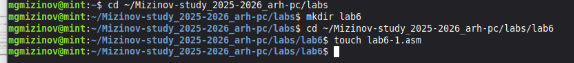

Рис. 1: Создаю начальные условия 

Код файла lab6-1.asm (рис. 2). 

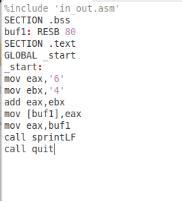

Рис. 2: Файл lab6-1.asm 

Запуск программы lab6-1.asm (рис. 3). 

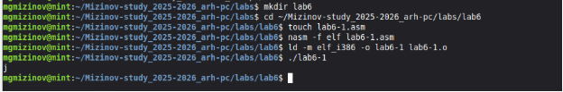

Рис. 3: Выполнение lab6-1.asm 

Изменим код программы (рис. 3). 

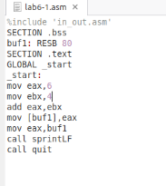

Рис. 4: Изменённый lab6-1.asm 

А затем снова запустим файл (рис. 5). 

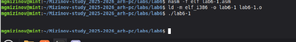

Рис. 5: Запуск изменённого lab6-1.asm 

Программа выдала пустую строчку, потому что символ 10 компьютер понимает как переход на новую строку 

Создаём файл lab6-2.asm и задаём ему код из листинга (рис. 6). 

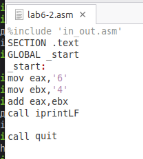

Рис. 6: Создание lab6-2.asm 

Запуск программы lab6-2.asm (рис. 7). 

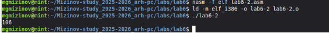

Рис. 7: Выполнение lab6-2.asm 

Изменим код программы lab6-2.asm (рис. 8). 

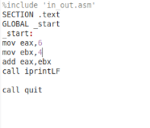

Рис. 8: Изменённый lab6-2.asm 

А затем снова запустим файл (рис. 9). 

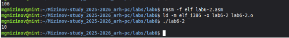

Рис. 9: Запуск изменённого lab6-2.asm 

Заменим функцию iprintLF на iprint. Создадим исполняемый файл и запустим его (рис. 9). 

Рис. 10: Запуск дважды изменённого lab6-2.asm Видно, что новая функция не добавляет \n в конце строки вывода. 

2. **Выполнение арифметических операций в NASM** Создание lab6-3.asm и заполнение его кодом из листинга (рис. 11).  

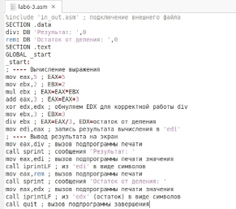

Рис. 11: Создание lab6-3.asm 

Запуск программы lab6-3.asm (рис. 12). 

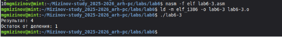

Рис. 12: Выполнение lab6-3.asm Изменим код программы lab6-3.asm (рис. 13). 

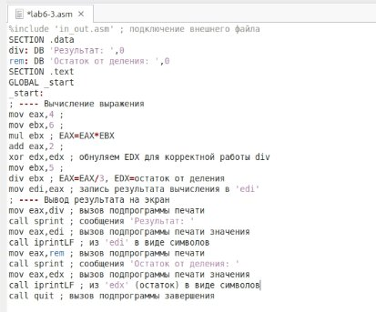

Рис. 13: Изменённый lab6-3.asm 

А затем снова запустим файл (рис. 14). 

Рис. 14: Запуск изменённого lab6-3.asm Создание variant.asm и заполнение его кодом из листинга (рис. 15).  

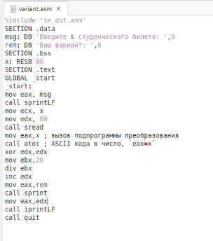

Рис. 15: Создание variant.asm 

Запуск программы variant.asm (рис. 16). 

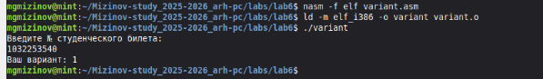

Рис. 16: Выполнение variant.asm 

Программа ищет вариант по формуле 

R=(x%20) +1 

Где R - это вариант, а x это мой номер студенческого билета. Мой билет заканчивается на 40, а значит программа вычислила мой вариант правильно. 

3. **Ответы на вопросы** 
1. Какие  строки  листинга  6.4  отвечают  за  вывод  на  экран  сообщения  ‘Ваш 

вариант:’?  

mov eax,rem  call sprint 

2. Для чего используется следующие инструкции? mov ecx, x mov edx, 80 call sread  mov ecx, x    ; Загружает адрес буфера для ввода данных 

   mov edx, 80   ; Устанавливает максимальную длину вводимой строки 

   call sread    ; Вызывает функцию чтения строки с клавиатуры 

3. Для чего используется инструкция “call atoi”?  

Подпрограмма atoi  преобразует  строку  символов  (ASCII-коды)  в соответствующее целочисленное значение, которое сохраняется в регистре EAX. 

4. Какие строки листинга 6.4 отвечают за вычисления варианта?  

mov ecx, x    ; Загружает адрес буфера для ввода данных 

mov edx, 80   ; Устанавливает максимальную длину вводимой строки call sread    ; Вызывает функцию чтения строки с клавиатуры 

5. В какой регистр записывается остаток от деления при выполнении инструкции “div ebx”?  

   При операции div ebx остаток от деления сохраняется в регистре EDX, в то время как частное записывается в EAX. 

6. Для чего используется инструкция “inc edx”?  

Команда inc  edx увеличивает  значение  в  регистре  EDX  на  единицу,  что необходимо для получения номера варианта в диапазоне от 1 до 20. 

7. Какие строки листинга 6.4 отвечают за вывод на экран результата вычислений? mov eax,edx    ; Копирование результата в EAX для вывода 

   call iprintLF  ; Вывод числа с переводом строки 

5\.  Задание для самостоятельной работы 

У меня вариант номер 1; и в соответствии с таблицей моя задача написать программу вычисления (2x+10)/3. 

Реализуем файл samos.asm (рис. 17). 

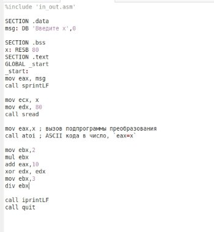

Рис. 17: Создание samos.asm 

Запуск программы variant.asm и проверка табличных значений (рис. 18). 

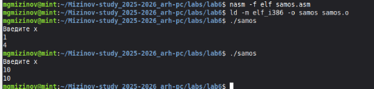

Рис. 18: Выполнение samos.asm 

Программа считает правильно: (10+2\*1)/3 = 12/3 = 4 

(10+2\*10)/3 = 30/3 = 10 

Ссылка на github: https://github.com/MihailMizinov/Mizinov-study\_2025-

2026\_arh-pc 

Выводы 

При  выполнении  данной  лабораторной  работы  я  приобрёл практические навыки работы с арифметическими операциями в Nasm Commander на базовом уровне. 

Список литературы 

1) Лабораторная  работа  №6. 

https://esystem.rudn.ru/pluginfile.php/2089086/mod\_resource/content/0/%D0%9B%D0 %B0%D0%B1%D0%BE%D1%80%D0%B0%D1%82%D0%BE%D1%80%D0%BD%D 0%B0%D1%8F%20%D1%80%D0%B0%D0%B1%D0%BE%D1%82%D0%B0%20%E 2%84%966.%20%D0%90%D1%80%D0%B8%D1%84%D0%BC%D0%B5%D1%82% D0%B8%D1%87%D0%B5%D1%81%D0%BA%D0%B8%D0%B5%20%D0%BE%D0 %BF%D0%B5%D1%80%D0%B0%D1%86%D0%B8%D0%B8%20%D0%B2%20NAS M..pdf  

2) Википедия. https://en.wikipedia.org/wiki/GitHub 
14 

