**РОССИЙСКИЙ УНИВЕРСИТЕТ ДРУЖБЫ НАРОДОВ** 

**Факультет физико-математических и естественных наук Кафедра прикладной информатики и теории вероятностей** 

**ОТЧЕТ** 

` `**ЛАБОРАТОРНАЯ РАБОТА № 7**  *дисциплина:  Архитектура компьютера *

Студент:  Мизинов М.Г.                      

Группа: НКАбд-04-25 

№ ст. билета: 1032253540                       

**МОСКВА** 2025 г. 

СОДЕРЖАНИЕ 

[Список иллюстраций......................................................................................................... 3 ](#_page2_x82.00_y56.92)[Список таблиц .................................................................................................................... 4 ](#_page3_x82.00_y56.92)[Основная часть................................................................................................................... 5 ](#_page4_x82.00_y56.92)

1. [Цель работы ............................................................................................................. 5 ](#_page4_x82.00_y74.92)
2. [Теоретическое введение ......................................................................................... 5 ](#_page4_x82.00_y180.92)
2. [Задание ..................................................................................................................... 5 ](#_page4_x82.00_y376.92)
2. [Выполнение лабораторной работы........................................................................ 6 ](#_page5_x82.00_y56.92)
1. [Реализация переходов в NASM ........................................................................... 6 ](#_page5_x82.00_y97.92)
1. [Изучение структуры файлы листинга................................................................. 9 ](#_page8_x82.00_y56.92)
5. [Задание для самостоятельной работы ................................................................. 10 ](#_page9_x82.00_y187.92)

[Выводы ............................................................................................................................. 13 ](#_page12_x82.00_y56.92)[Список литературы .......................................................................................................... 14 ](#_page13_x82.00_y56.92)

Список иллюстраций 

Рисунок 1 – Создаю начальные условия  ………...…………………………...…...….6 Рисунок 2 – Файл lab7-1.asm ….……………………………………………………….6 Рисунок 3 – Выполнение lab7-1.asm ………….…………..………………..………….6 Рисунок 4 – Изменённый lab7-1.asm ……………………………...……….………….7 Рисунок 5 – Запуск изменённого lab7-1.asm ……………………….………………...7 Рисунок 6 – Дважды изменённый lab7-1.asm ……………………………………...…7 Рисунок 7 – Запуск дважды изменённого lab7-1.asm ………………………………..7 Рисунок 8 – Создание lab7-2.asm ………….……………………...……….………….8 Рисунок 9 – Запуск lab7-2.asm …………………………..………….…………………8 Рисунок 10 – Изучение lab7-2.lst …………….……………..………………………....9 Рисунок 11 – Изменённый lab7-2.asm ……………………………………….……......9 Рисунок 12 – Проверка изменённого lab7-2.asm ……………………………...….….10 Рисунок 13 – Создание code1.asm …………………………..…...……….….………..11 Рисунок 14 – Выполнение code1.asm ……………………………...………….………11 Рисунок 15 – Создание code2.asm …………...……………………………….……......11 Рисунок 16 – Выполнение code2.asm………..……………………..……….......….….12 

Список таблиц 

Основная часть 

1. Цель работы 

Изучение  команд  условного  и  безусловного  переходов.  Приобретение навыков  написания  программ  с  использованием  переходов.  Знакомство  с назначением и структурой файла листинга. 

2. Теоретическое введение 

Для  реализации  ветвлений  в  ассемблере  используются  так  называемые команды  передачи  управления  или  команды  перехода.  Можно  выделить  2  типа переходов:  

- условный  переход  –  выполнение  или  не  выполнение  перехода  в 

определенную точку программы в зависимости от проверки условия.  

- безусловный  переход  –  выполнение  передачи  управления  в 

определенную точку программы без каких-либо условий. 

3. Задание 

На  основе  методических  указаний  провести  ознакомительную  работу  с командами безусловного и условного переходов в Nasm. 

4. Выполнение лабораторной работы 
1. **Реализация переходов в NASM** Создал папку lab7 и файл asm (рис. 1). 

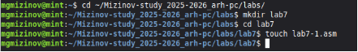

Рис. 1: Создаю начальные условия 

Код файла lab7-1.asm (рис. 2). 

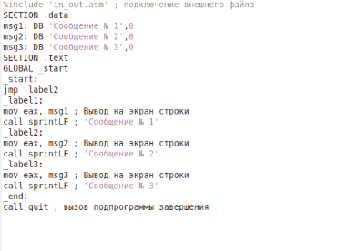

Рис. 2: Файл lab7-1.asm 

Запуск программы lab7-1.asm (рис. 3). 

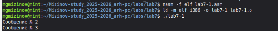

Рис. 3: Выполнение lab6-1.asm 

Изменим код программы (рис. 3). 

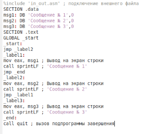

Рис. 4: Изменённый lab7-1.asm 

А затем снова запустим файл (рис. 5). 

Рис. 5: Запуск изменённого lab7-1.asm 

Теперь снова изменим файл чтобы строки выводились в нужном порядке 

(рис. 6). 

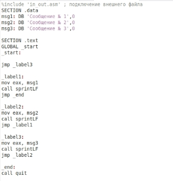

Рис. 6: Дважды изменённый lab7-1.asm 

Запуск изменённой дважды программы lab7-1.asm (рис. 7). 

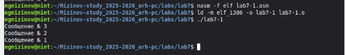

Рис. 7: Запуск дважды изменённого lab7-1.asm Создадим программу lab7-2.asm (рис. 8). 

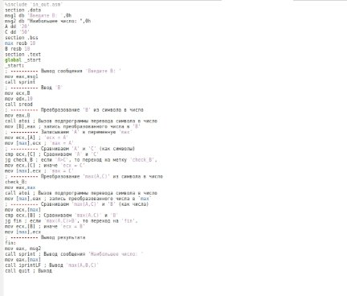

Рис. 8: Создание lab7-2.asm 

А затем запустим её (рис. 9). 

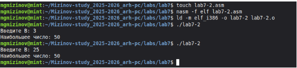

Рис. 9: Запуск lab7-2.asm 

2. **Изучение структуры файлы листинга****  

Ознакомимся с файлом lab7-2.lst, его форматом и содержимым (рис. 10).  

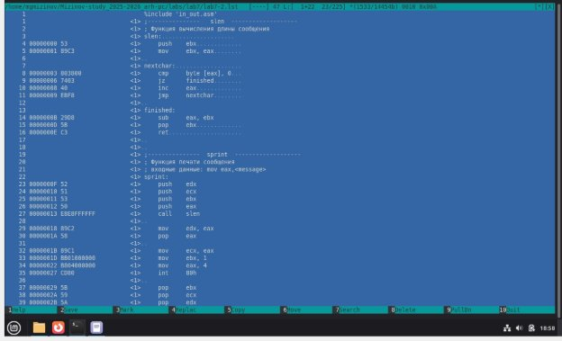

Рис. 10: Изучение lab7-2.lst 

Формат строки в файле листинга такой: первым делом идёт её внутренний номер (не обязательно тот же, что в исходном файле). Далее указывается адрес — то есть, смещение машинного кода в сегменте. После этого следует сам машинный код, а завершает всё исходный текст программы, включая комментарии. 

Удаляю  один  операнд,  чтобы  проверить  поведение  файла  листинга  в дальнейшем (рис. 11). 

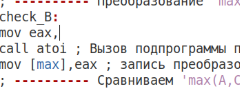

Рис. 11: Изменённый lab7-2.asm Проверка изменённой программы lab7-2.asm (рис. 12). 

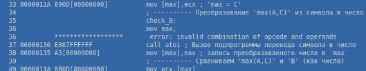

Рис. 12: Проверка изменённого lab7-2.asm Как и ожидалось программа пишет ошибку. 

5. Задание для самостоятельной работы 

У меня вариант номер 1, как я выяснил во время 6й лабораторной работы. А значит использую следующие данные: 

Значения  ,  ,  : 

17,23,45  

Выражение для  ( ) {    2a-x, x<a 

`         `{  

{   8, x>=a 

X1: 1 A1: 2 

X2: 2 A2: 1 

Реализуем файл code1.asm для первого индивидуального задания (рис. 13). 

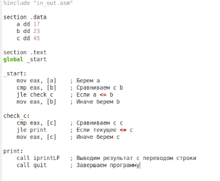

Рис. 13: Создание code1.asm 

Запуск программы code1.asm и проверка табличных значений (рис. 14). 

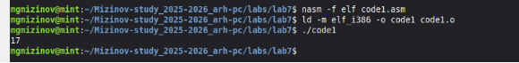

Рис. 14: Выполнение code1.asm 

Реализуем файл code2.asm для второго индивидуального задания (рис. 15). 

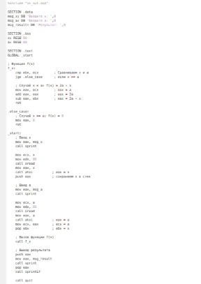

Рис. 15: Создание code2.asm 

Запуск программы code2.asm (рис. 16). 

Рис. 16: Выполнение code2.asm 

Ссылка на github: https://github.com/MihailMizinov/Mizinov-study\_2025-

2026\_arh-pc 

Выводы 

При  выполнении  данной  лабораторной  работы  я  приобрёл практические навыки работы с командами безусловного и условного переходов в Nasm. 

Список литературы 

1) Лабораторная  работа  №7. 

https://esystem.rudn.ru/pluginfile.php/2089087/mod\_resource/content/0/%D0%9B%D0 %B0%D0%B1%D0%BE%D1%80%D0%B0%D1%82%D0%BE%D1%80%D0%BD%D 0%B0%D1%8F%20%D1%80%D0%B0%D0%B1%D0%BE%D1%82%D0%B0%20%E 2%84%967.%20%D0%9A%D0%BE%D0%BC%D0%B0%D0%BD%D0%B4%D1%8B %20%D0%B1%D0%B5%D0%B7%D1%83%D1%81%D0%BB%D0%BE%D0%B2%D 0%BD%D0%BE%D0%B3%D0%BE%20%D0%B8%20%D1%83%D1%81%D0%BB% D0%BE%D0%B2%D0%BD%D0%BE%D0%B3%D0%BE%20%D0%BF%D0%B5%D 1%80%D0%B5%D1%85%D0%BE%D0%B4%D0%BE%D0%B2%20%D0%B2%20Na sm.%20%D0%9F%D1%80%D0%BE%D0%B3%D1%80%D0%B0%D0%BC%D0%BC %D0%B8%D1%80%D0%BE%D0%B2%D0%B0%D0%BD%D0%B8%D0%B5%20% D0%B2%D0%B5%D1%82%D0%B2%D0%BB%D0%B5%D0%BD%D0%B8%D0%B9 ..pdf 

2) Википедия. https://en.wikipedia.org/wiki/GitHub 
14 
