**РОССИЙСКИЙ УНИВЕРСИТЕТ ДРУЖБЫ НАРОДОВ** 

**Факультет физико-математических и естественных наук Кафедра прикладной информатики и теории вероятностей** 

**ОТЧЕТ \
ЛАБОРАТОРНАЯ РАБОТА № 9**      *дисциплина:  Архитектура компьютера *

`            `Студент: Мизинов М.Г. Группа: НКАбд-04-25 

№ ст. билета: 1032253549 

**МОСКВА** 2025 г. 

СОДЕРЖАНИЕ 

[Список иллюстраций ](#_page2_x82.00_y64.04).........................................................................................................[ 3 ](#_page2_x82.00_y64.04)[Основная часть ](#_page3_x82.00_y52.04)...................................................................................................................[ 4 ](#_page3_x82.00_y52.04)

1. [Цель работы ](#_page3_x82.00_y71.04)....................................................................................................................[ 4 ](#_page3_x82.00_y71.04)
2. [Теоретическое введение ](#_page3_x82.00_y191.04)................................................................................................[ 4 ](#_page3_x82.00_y191.04)
2. [Выполнение лабораторной работы ](#_page4_x82.00_y64.04)..............................................................................[ 5 ](#_page4_x82.00_y64.04)
2. [Задание для самостоятельной работы ](#_page12_x82.00_y178.04)........................................................................[ 13 ](#_page12_x82.00_y178.04)[Выводы ](#_page14_x82.00_y67.04).............................................................................................................................[ 16 ](#_page14_x82.00_y67.04)[Список литературы ](#_page15_x82.00_y64.04)..........................................................................................................[ 17 ](#_page15_x82.00_y64.04)

Список  иллюстраций 

Рисунок 1 – Создание каталога и lab9-1.asm .................................................................. 5 Рисунок 2 – Файл lab9-1.asm ............................................................................................ 5 Рисунок 3 – Выполнение lab9-1.asm ................................................................................5 Рисунок 4 – Изменённый lab9-1.asm ................................................................................ 6 Рисунок 5 – Запуск изменённого lab9-1.asm....................................................................6 Рисунок 6 – Файл lab9-2.asm ............................................................................................ 7 Рисунок 7 – Загрузка в отладчик gdb ............................................................................... 7 Рисунок 8 – Проверка работы программы в gdb ............................................................ 8 Рисунок 9 – брейкпоинт ................................................................................................... 8 Рисунок 10 – Команда disassemble ................................................................................... 8 Рисунок 11 – Intel синтаксис ............................................................................................ 9 Рисунок 12 – Режим псевдографики ................................................................................ 9 Рисунок 13 – info breakpoints ......................................................................................... 10 Рисунок 14 – Адрес предпоследней инструкции .......................................................... 10 Рисунок 15 – Информация о установленных точках останова ................................... 10 Рисунок 16 – Содержимое регистров ............................................................................ 11 Рисунок 17 – Значение переменной msg1 ..................................................................... 11 Рисунок 18 – Изменение символов................................................................................ 11 

Рисунок 19 – Изменение значения регистра ebx .......................................................... 12 Рисунок 20 – Копия lab8-2.asm ..................................................................................... 12 Рисунок 21 – Создание lab9-3.asm и загрузка в откладчик ........................................ 12 Рисунок 22 – Запуск lab9-3.asm и адрес вершины стека ............................................ 13 Рисунок 23 – Позиция стека ........................................................................................... 13 Рисунок 24 – Преобразованная программа................................................................... 14 Рисунок 25 – Работа lab9-4.asm ..................................................................................... 14 Рисунок 26 – Неверный результат ................................................................................. 15 Рисунок 27 – Исправленная программа ......................................................................... 15 Рисунок 28 – Верный результат ..................................................................................... 15 

Основная  часть 

1. Цель  работы 

Приобретение  навыков  написания  программ  с  использованием  подпрограмм. Знакомство с методами отладки при помощи GDB и его основными возможностями. 

2. Теоретическое введение 

Отладка — это процесс поиска и исправления ошибок в программе. В общем случае его можно разделить на четыре этапа:  

- обнаружение ошибки;  
- поиск её местонахождения;  
- определение причины ошибки;  
- исправление ошибки. 
3. Задание 

На основе методических указаний провести ознакомительную работу с методами отладки при помощи GDB. 

4. Выполнение лабораторной работы 
1. **Реализация подпрограмм в  NASM** 

Создал каталог для выполнения лабораторной работы № 9 и файл lab9-1.asm (рис. 1): 

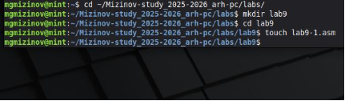

Рис. 1: Создание каталога и lab9-1.asm Записал код из листинга в lab9-1.asm (рис. 2): 

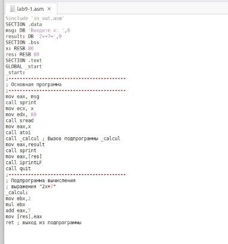

Рис. 2: Файл lab9-1.asm Запустил программу lab9-1.asm (рис. 3): 

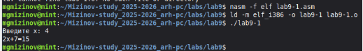

Рис. 3: Выполнение lab9-1.asm 

Изменил код программы, добавив подпрограмму \_subcalcul в подпрограмму \_calcul (рис. 4): 

Рис. 4: Изменённый lab9-1.asm Запустил изменённый файл (рис.5): 

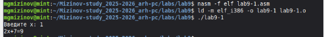

Рис. 5: Запуск изменённого lab9-1.asm 

2. **Отладка программам с помощью GDB** 

Создал файл lab9-2.asm с текстом программы из Листинга 9.2 (рис.6): 

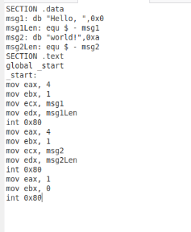

Рис. 6: Файл lab9-2.asm 

Получил  исполняемый  файл. Добавил  отладочную  информацию,  трансляцию программ проводил с ключом ‘-g’. Загрузил исполняемый файл в отладчик gdb (рис.7): 

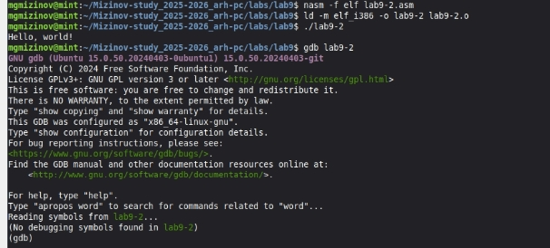

Рис. 7: Загрузка в отладчик gdb. 

Проверил работу программы (рис.8): 

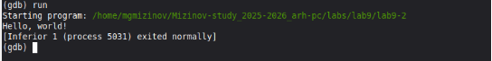

Рис. 8: Проверка работы программы в gdb. Установил брейкпоинт на метку \_start (рис.9):** 

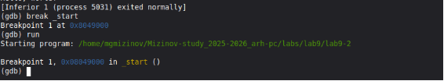

Рис. 9: брейкпоинт 

Посмотрел  дисассимилированный  код  программы  с  помощью  команды disassemble начиная с метки \_start (рис. 10): 

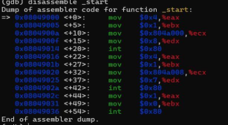

Рис. 10: Команда disassemble Переключился на отображение команд с Intel синтаксисом (рис.11):

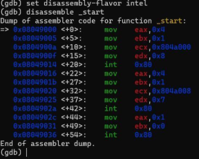

Рис. 11: Intel синтаксис 

Различия между синтаксисом ATT и Intel заключаются в порядке операндов, их размере, именах регистров 

Включил режим псевдографики (рис.12): 

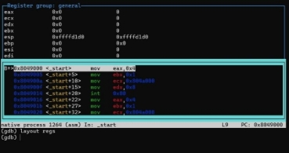

Рис. 12: режим псевдографики 

3. **Добавление точек останова** 

На предыдущих шагах была установлена точка останова по имени метки. 

Проверил это с помощью команды info breakpoints(рис.13):  

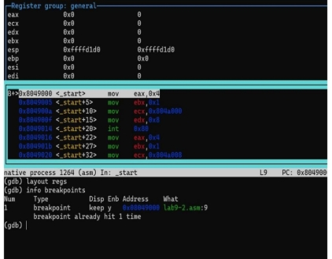

Рис. 13: info breakpoints 

Определил адрес предпоследней инструкции (mov ebx,0x0) и установил точку останова (рис.14): 

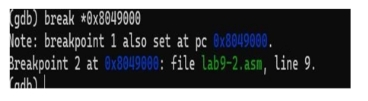

Рис. 14: Адрес предпоследней инструкции  Посмотрел информацию о всех установленных точках останова (рис.15): 

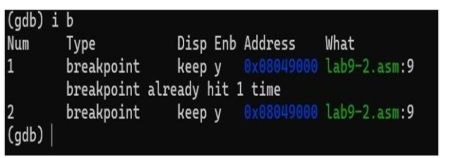

Рис. 15: Информация о установленных точках останова 

4. **Работа с данными программы в GDB** Посмотрел содержимое регистров (рис.16): 

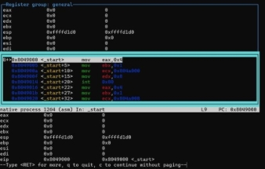

Рис. 16: Содержимое регистров 

` `Посмотрел значение переменной msg1 по имени (рис. 17): 

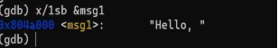

Рис. 17: Значение переменной msg1 

Изменил первый символ переменной msg1 и заменил случайный символ во второй переменной msg2 (рис. 18): 

Рис. 18: Изменение символов 

С помощью команды set изменил значение регистра ebx (рис. 18): 

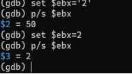

Рис. 19: Изменение значения регистра ebx   Разница вывода команд p/s $ebx в том, что в set $ebx='2' 

это, а не число,а символ '2' имеет код 50.Команда set $ebx='2' записывает в регистр код символа '2', то есть число 50 

В set $ebx=2 2 - это число. Команда записывает в регистр EBX число 2 

5. **Обработка аргументов командной строки в GDB** 

Скопировал файл lab8-2.asm в файл с именем lab9-3.asm (рис. 20): 

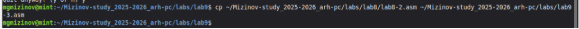

Рис. 20: Копия lab8-2.asm 

Создал исполняемый файл и загрузила его в отладчик (рис. 21): 

Рис. 21: Создание lab9-3.asm и загрузка в откладчик 

Установил точку останова перед первой инструкцией в программе и запустил ее (рис. 22): 

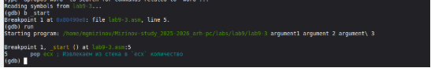

Рис. 22: Запуск lab9-3.asm и адрес вершины стека Посмотрел остальные позиции стека (рис. 23): 

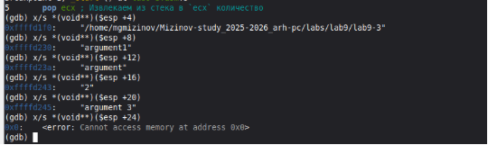

Рис. 23: Позиции стека 

Шаг равен 4, потому что в 32-битной архитектуре размер каждого элемента в стеке составляет 4 байта (32 бита = 4 байта). 

5. **Задание для самостоятельной работы** 

\1) Преобразовал программу из лабораторной работы №8 (Задание №1 для самостоятельной  работы),  реализовав  вычисление  значения  функции  как подпрограмму (рис\. 24): 

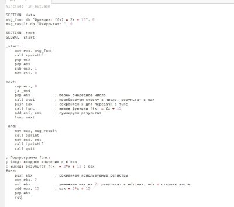

Рис. 24: Преобразованная программа Запуск преобразованной программы (рис. 25): 

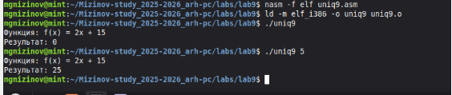

Рис. 25: Работа lab9-4.asm 

В листинге 9.3 приведена программа вычисления выражения 

При  запуске  данная  программа  дает  неверный  результат (рис. 26): 

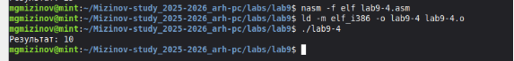

Рис. 26: Неверный результат Исправим программу (рис. 27): 

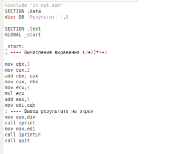

Рис. 27: Исправленная программа 

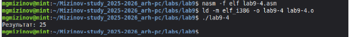

Рис. 28: Верный результат 

Ссылка на github: https://github.com/MihailMizinov/Mizinov-study\_2025-2026\_arh-pc 

**Вывод** 

При  выполнении  данной  лабораторной  работы  я  приобрел  навыки написания  программ  с  использованием  подпрограмм.  Познакомился  с  методами отладки при помощи GDB и его основными возможностями 

**Список  литературы** 

1) Лабораторная  работа  №9. 

https://esystem.rudn.ru/pluginfile.php/2089095/mod\_resource/content/0/%D0%9B%D0 %B0%D0%B1%D0%BE%D1%80%D0%B0%D1%82%D0%BE%D1%80%D0%BD%D 0%B0%D1%8F%20%D1%80%D0%B0%D0%B1%D0%BE%D1%82%D0%B0%20%E 2%84%968.%20%D0%9F%D1%80%D0%BE%D0%B3%D1%80%D0%B0%D0%BC% D0%BC%D0%B8%D1%80%D0%BE%D0%B2%D0%B0%D0%BD%D0%B8%D0%B 5%20%D1%86%D0%B8%D0%BA%D0%BB%D0%B0.%20%D0%9E%D0%B1%D1% 80%D0%B0%D0%B1%D0%BE%D1%82%D0%BA%D0%B0%20%D0%B0%D1%80 %D0%B3%D1%83%D0%BC%D0%B5%D0%BD%D1%82%D0%BE%D0%B2%20% D0%BA%D0%BE%D0%BC%D0%B0%D0%BD%D0%B4%D0%BD%D0%BE%D0% B9%20%D1%81%D1%82%D1%80%D0%BE%D0%BA%D0%B8..pdf 

2) Википедия. https://en.wikipedia.org/wiki/GitHub 
16 
